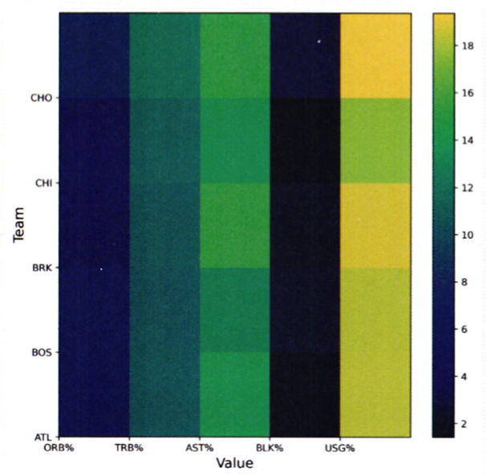

# 통계학 1주차 정규과제

📌통계학 정규과제는 매주 정해진 분량의 『*데이터 분석가가 반드시 알아야 할 모든 것*』 을 읽고 학습하는 것입니다. 이번 주는 아래의 **Statistics_1st_TIL**에 나열된 분량을 읽고 `학습 목표`에 맞게 공부하시면 됩니다.

아래의 문제를 풀어보며 학습 내용을 점검하세요. 문제를 해결하는 과정에서 개념을 스스로 정리하고, 필요한 경우 추가자료와 교재를 다시 참고하여 보완하는 것이 좋습니다.

1주차는 `1부. 데이터 기초체력 기르기`를 읽고 새롭게 배운 내용을 정리해주시면 됩니다.


## Statistics_1st_TIL

### 1부. 데이터 기초체력 기르기
### 01. 통계학 이해하기
### 02. 모집단과 표본추출
### 03. 변수와 척도
### 04. 데이터의 기술 통계적 측정
### 05. 확률과 확률변수

## Study Schedule

|주차 | 공부 범위     | 완료 여부 |
|----|----------------|----------|
|1주차| 1부 p.2~56     | ✅      |
|2주차| 1부 p.57~79    | 🍽️      | 
|3주차| 2부 p.82~120   | 🍽️      | 
|4주차| 2부 p.121~202  | 🍽️      | 
|5주차| 2부 p.203~254  | 🍽️      | 
|6주차| 3부 p.300~356  | 🍽️      | 
|7주차| 3부 p.357~615  | 🍽️      | 

<!-- 여기까진 그대로 둬 주세요-->
<br>

# 01. 통계학 이해하기

```
✅ 학습 목표 :
* 통계학의 필요성에 대해 인식한다.
* 기술통계와 추론통계의 특성을 구분할 수 있다.
```
<!-- 새롭게 배운 내용을 자유롭게 정리해주세요.-->
### 1.1 왜 통계학을 알아야 할까?
---
데이터 과학은 기초 통계로부터 발전   
-> 통계 이론에 기반한 해석이 필수적임   

기업 수준의 의사결정에 `통계학적 사고를 통한 분석`이 중요함    


📶 __데이터 과학의 프로세스__

    1. 데이터 수집
    2. 데이터 가공
    3. 탐색적 데이터 분석 & 데이터 시각화
    4. M/L 모델링
    5. 결과 해석 및 적용
  

     
### 1.2 머신러닝과 전통적 통계학의 차이
---
머신러닝의 주목적은 예측력을 높이는 것   
-> 분석 모형의 복잡성이 높고, 과적합 해결에 집중   

통계학의 주목적은 확률을 통해 가설을 검증하고 추정 모델을 통해 데이터를 해석하는 것  
-> 신뢰도 중시, 단순성 추구, 샘플의 가정과 통계적 적합성에 집중

_통계학의 확률적 이론과 에러를 최소화하는 원리_ 를 기반으로 머신러닝, 데이터 과학이 완성됨

머신러닝은 _데이터의 학습과 분류, 예측 자체_ 를 학습하도록 프로그래밍 됨



통계학: 과거와 현재 데이터를 활용하여 현상을 해석, 의미를 찾음 (통계적 수치 검정)  
머신러닝: 미래를 예측하고, 모델에 기반한 정확한 분류나 선택을 하는 것에 목적을 둠 (예측 정확도를 높이기 위한 알고리즘을 적용한 모델 생성)

### 1.3 통계학의 정의와 기원
---
- __통계학__   
: 자료를 수집, 분석하여 그 분석 결과를 통해 효율적인 의사결정을 하는 기법을 연구하는 학문   
-> 자료(데이터)를 가공하여 의미를 만들어 의사결정에 도움이 되도록 하는 것!

### 1.4 기술 통계와 추론 통계
---
- __기술통계__    
: 문자 그대로 주어진 데이터의 특성을 사실에 근거하여 설명하고 묘사하는 것    
대푯값(평균, 중앙값, 최빈값, 가중평균, 기하평균, 조화평균 등)을 활용하여 설명

    - EDA(탐색적 데이터 분석)): 기술 통계를 내는 것 (ex. 시각화)   

- __추론 통계__   
: 표본 집단으로부터 모집단의 특성을 추론하는 것을 목적으로 하는 것 (신뢰구간을 구함)

📶 __기술 통계와 추론 통계의 통합적인 프로세스__     
: 표본 특성 분석 -> 특성의 일반화 여부 판단-> 모집단의 특성으로 추정

<br>
<br>

# 02. 모집단과 표본추출

```
✅ 학습 목표 :
* 모집단과 표본의 정의와 관계를 설명할 수 있다.
* 편향과 분산의 차이를 설명할 수 있다.
```

<!-- 새롭게 배운 내용을 자유롭게 정리해주세요.-->

### 2.1 모집단과 표본, 전수조사와 표본조사   
___
- 모집단: 분석 대상 전체의 집단
- 표본: 모집단의 부분집합, 즉 모집단의 일부를 추출한 것 
- 전수조사: 모집단의 자료 전체를 조사 및 분석하여 정보를 추출하는 것
- 표본조사: 모집단에서 추출한 표본을 통해 모집단의 정보(평균, 표준편차 등)를 추정하고 검정하는 것    

### 2.2 표본조사를 하는 이유와 데이터과학 적용 방법
___
❓ _모델링 단계에서 전수 데이터를 모두 사용할까?_   
-> ❌ : 최종분석에는 전체 데이터를 사용하더라도, `분석 모델이 완성될 때까지는 표본 데이터를 활용하는 것`이 경제적, 시간적으로 유리함!   

📶 __예측 및 분류 모델링 프로세스__ 

    1. 표본 추출   
    2. 데이터 전처리 및 M/L 프로세스 개발   
    3. 전수 데이터 가공   
    4. 최종 모델 검증 및 예측

❓ _표본조사를 통해 모집단의 크기를 유추하려면?_   
-> __표지 재포획법__  
${100\over N} \approx {n \over 100}$


### 2.3 표본추출에서 나타나는 편향의 종류
___
- 표본 오차: 모집단과 표본의 자연 발생적인 변동   
-> 같은 크기의 두 개의 표본을 주의해서 추출한다해서 완전히 동일한 표본을 얻는 것은 불가능함을 의미함   

- 비표본 오차: 표본 오차를 제외한 변동   
- 편향: 비표본 오차의 한 원인

🔢 __표본 추출 과정에서 발생하는 편향__
```
1. 표본추출편향
  : 표본 추출 과정에서 체계적인 경향이 개입되어 모집단에서 편향된 표본만 추출되는 경우
2. 가구편향
  : 모집단의 부분 집단 단위에서 하나의 관측치씩 추출하는 경우 크고 적은 집단이 작고 많은 집단보다 적게 추출되는 경우
3. 무응답편향
  : 설문에 응답하지 않는 사람들과 응답하는 사람들에 체계적인 차이가 있는 경우
4. 응답편향
  : 설문 형식의 문제, 응답자의 심리적 이슈에 의해 표본이 영향을 받는 경우
```

브리들리 효과: 피조사자가 자신의 생각이나 신념을 밝히기 어려워하여 거짓된 응답을 하는 현


- 확률화: 모집단으로부터 편향이 발생하지 않는 표본을 추출하는 방법   
    - 확률표본: 확률화를 통해 추출한 표본
    - 확률추출: 모집단에서 표본이 추출될 확률이 동등한 추출
    - 비확률추출: 모집단에서 표본이 추출될 확률이 동등하지 않은 추출
    - 복원추출: 모집단에서 이미 추출한 표본을 다시 모집단에 되돌려 놓는 추출
    - 비복원추출: 모집단에서 이미 추출한 표본을 다시 모집단에 되돌려 놓지 않는 추출

### 2.4 인지적 편향의 종류
---
- __인지적 편향__   
: 사람들은 언제나 합리적으로 생각하고 행동하는 것이 아니며, 휴리스틱을 통해 `왜곡된 지각`으로 결정을 하는 경우가 많다
    - 확증 편향: 자신이 본래 믿고 있는 대로 정보를 선택적으로 받아들이고 임의로 판단하는 편향
    - 기준점 편향: 분석가가 가장 처음에 접하는 정보에 지나치게 매몰되는 편향
    - 선택 지원 편향: 본인이 의사결정을 내리는 순간 그 선택의 긍정적인 부분에 대해 더 많이 생각하고 그 결정에 반대되는 증거를 무시하게 되는 편향
    - 분모 편향: 분수 전체가 아닌 분자에만 집중하여 현황을 왜곡하여 판단하게 되는 편향
    - 생존자 편향: 소수의 성공한 사례를 일반화된 것으로 인식함으로써 나타나는 편향

### 2.5 머신러닝 모델 측면의 편향과 분산
---
편향: 예측값들이 정답과 일정하게 차이가 나는 정도   
분산: 주어진 데이터 포인트에 대한 모델 예측의 가변성  
-> _편향과 분산은 트레이드오프 관계!_

### 2.6 표본 편향을 최소화하기 위한 푶본 추출 방법
---
- 두 가지 표본추출
    - 데이터 수집 단계의 표본 추출
    - 빅데이터에서 분석 모델링을 위한 적절한 크기의 표본데이터 추출   

📶 __표본 추출의 단계__
```
1. 모집단 확정
2. 표본 프레임 결정
3. 표본 추출방법 결정
4. 표본크기 결정
5. 표본추출
```

🔠 __표본 추출의 방법__
- 단순 임의 추출방법
- 계층적 표본추출방법
- 층화 표본추출방법
- 군집 표본추출방법
- 복원추출법
- 비복원추출법

<br>
<br>

# 03. 변수와 척도
```
✅ 학습 목표 :
* 독립변수, 종속변수의 관계를 파악할 수 있다.
* 척도(변수의 데이터적 속성)의 종류를 설명할 수 있다.
```
<!-- 새롭게 배운 내용을 자유롭게 정리해주세요.-->

### 3.1 변수의 종류
---
- 양적 변수: 계량적 변수
    - 이산변수: 정숫값만 취할 수 있는 변수
    - 연속변수: 연속적인 모든 실숫값을 취할 수 있는 변수
- 질적 변수: 비계량적 변수

- 독립변수: 원인
    - 설명변수
    - 입력변수
    - 예측변수
    - 조직변수
    - 특징(feature)
- 종속변수: 결과
    - 반응변수
    - 출력변수
    - 피예측변수
    - 측정변수
    - 표적변수(target)
    
- 통제변수: 종속변수에 영향을 줄 수 있는 외부 요소를 통제하기 위해 사용하는 변수


### 3.2 변수 관계의 종류
---
- 인과관계: 변수가 다른 변수의 원인이 되는 영향
- 상관관계: 변수 간의 관련성이 존재하는 관계
- 독립관계: 변수 간 상관성, 즉 상관계수가 0인 관계
- 의사관계: 변수 간 상관성은 있지만, 그 상관성이 다른 변수에 의해 나타나는 관계 (ex. 일별 아이스크림 판매량과 익사사고 발생 수의 상관관계는 '기온'이라는 제3의 변수와의 관계 때문!)
- 양방향적 인과관계: 두 변수가 서로 간에 인과적 영향을 미치는 관계
- 조절관계: 독립변수와 종속변수 사이에서 강하고 불확정적인 영향을 미치는 관계 (ex. 업무만족도에 기업매출의 관계에서 '성별'이라는 조절변수 추가) (관계의 강도 조절)
- 매개관계: 독립변수와 종속변수의 중간에서 매개변수가 개입되어 독립변수의 영향을 종속변수에 전달하는 관계 

### 3.3 척도의 종류
---
- __척도__   
: 측정하고자 하는 대상을 수치화하는 것에 사용되는 일종의 측정 도구

- 질적 척도
    - 명목 척도: 성별, 혈액형 등
    - 서열 척도: 석차, FIFA 순위 등
- 양적 척도
    - 등간 척도: 온도, IQ 등
    - 비율 척도: 몸무게, 매출액 등

<br>

🔠 __변수의 척도에 따른 분석 방법__


<br>
<br>

# 04. 데이터의 기술 통계적 측정

```
✅ 학습 목표 :
* 산포도의 의미를 설명하고 측정방법을 나열할 수 있다.
* 정규분포의 왜도값과 첨도값이 얼마인지 답할 수 있다.
```

<!-- 새롭게 배운 내용을 자유롭게 정리해주세요.-->
### 4.1 중심 성향의 측정
---
__표본의 중심 성향__

- 평균값
    - 산술평균: 전체 변숫값 / 값들의 개수
    - 가중평균: 더 많은 비중을 차지하는 집단에 가중치를 더해 구하는 평균값
    - 기하평균: 시간적인 변화를 고려하여 비율의 평균을 구하는 것
    - 조화평균: 시간적인 변화를 고려하여 값의 평균을 구하는 것
    $$2\over{(1/80+1/120)}$$

- 중앙값
- 최빈값

### 4.2 분산과 표준편차
---
- 분산: 편차의 제곱합을 관측치의 개수로 나눈 것
- 표준편차: 분산에 제곱근을 씌워 실제 편차의 규모와 유사하게 조정한 것   
*표본의 경우 관측치의 수($N$)이 아닌 자유도 ($n-1$)로 나눠줘야 한다

<br>

- __슈하트 관리도__
: 평균값보다 표준편차의 3배 크기의 차이가 넘게 나면 이상징후로 판단하고 신속한 대처를 하도록 하는 일종의 관리 시스템

### 4.3 산포도와 범위, 사분위수, 변동계수
---
- 산포도(분산도): 대푯값을 중심으로 자료들이 흩어져 있는 정도
    - 측정방법: 범위, 분산, 표준편차, 사분위수 범위, 변동계수

<br>

- 사분위수: 전체 데이터의 순서에 따른 위치 값
- 변동 계수: 표준편차를 산술평균으로 나누어 준 값

### 4.4 왜도와 첨도
---
- 왜도: 데이터 분포의 좌우 비대칭도   

- __피어슨 비대칭 걔수__: 왜도를 측정하는 방법   
    : 평균값, 중앙값, 최빈값 간의 차이를 비교한 후, 그 차이를 표준편차로 나눈 값
    $$3(평균값-중앙값)\over {표본의 표준편차}$$

    *보통 0보다 작거나 3보다 크면 데이터가 정규성을 가지지 않는다고 판단함!

- 첨도: 분포가 정규분포보다 얼마나 뾰족하거나 완만한지의 정도를 나타내는 척도

    
*첨도가 음수로 작을수록 분포는 넓게 퍼져있고, 양수로 클수록 뾰족함

### 4.5 표준편차의 경험법칙
---

- 경험법칙: 정규분포에서 표준편차를 통해 데이터 값들의 범위를 가늠하는 것


이를 통해 데이터의 최댓값과 최솟값, 범위 추정 가능   
- 최댓값: 평균 + 3표준편차
- 최솟값: 평균 - 3표준편차
- 데이터의 범위: 6표준편차   
-> 따라서 범위를 6으로 나눈 것은 표준편차의 근삿값이다!    

❗️ _하지만 경험법칙은 통계적으로 표본의 크기가 최소 100 이상은 되어야 성립_   
- 30~100 : 범위/4
- 30 미만: 유의미한 범위 측정 불가
- 정규분포가 아니거나 분포를 모를 경우: 체비셰프의 정리 적용 

__체비셰프의 정리__   
: 분포의 모양과 상관없이 평균값 +_2 표준편차 범위에 반드시 75% 이상의 데이터 존재, +- 3범위에서는 적어도 89%, +-4 범위에서는 적어도 94%


<br>
<br>

# 05. 확률과 확률변수

```
✅ 학습 목표 :
* 확률변수의 개념과 종류를 설명할 수 있다.
* 심슨의 역설을 설명하고, 발생 원인을 식별하며, 이를 해결하기 위한 방안을 도출할 수 있다.
```

<!-- 새롭게 배운 내용을 자유롭게 정리해주세요.-->

### 5.1 확률의 기본개념
---
- 확률: 일정한 조건 안에서 특정 사건이 일어날 수 있는 가능성의 정도 (0~1)
- 표본공간: 통계적 실험을 통해 발생할 수 있는 모든 사건의 집합

### 5.2 확률의 종류
---
- 비조건 확률(한계확률): 아무런 조건이 없는 상황에서 사건이 일어날 확률
- 결합확률: 표본공간 안에서 일어나는 사건 각각의 조합으로 이루어지는 확률 (사건의 교집합)
- 조건부 확률: 하나의 사건이 먼저 발생했다는 조건에 전제된 상황에서 또 다른 사건이 발생할 확률


### 5.3 분할과 베이지안 이론

- __분할__   
: 사건들을 모두 합했을 때 전체 사건들을 포괄하되, 중복이 일어나지 않는 사건들의 집합    

- __베이지안 이론__    
: 특정한 사건 $A$ 가 발생하면 `그 사건의 원인이 되는 사건들의 사전 확률을 이용하여 사건 $A$ 의 원인이 될 수 있는 사후확률을 알아내는 것`
    - P(A): A의 사전 확률
    - P(B): B의 사전 확률
    - p(B|A): 사건 A(원인)가 전제됐을 때 사건 B(결과)의 조건부확률 (우도 확률)
    - p(A|B): 사건 B(결과)가 발생했다는 조건에서 사건 A(원인)가 발생했을 확률 (사후 확률)

사전확률 -> 새로운 정보(우도 확률) -> 베이즈 정리의 응용 -> 사후확률


### 5.4 확률변수의 개념과 종류
---
- 확률변수: 특정 값이 변할 수 있는 확률이 주어진 변수 (ex. 표본평균, 표본분산)
    - 이산확률변수: 변수가 가질 수 있는 값이 실숫값
    - 연속확률변수: 변수가 가질 수 있는 값이 연속형 값 (특정 구간이 나올 수 있는 확률)

### 5.5 심슨의 역설
---
- 심슨의 역설: 데이터의 정보를 압축해서 보여주는 `확률의 특성을 고려하지 않아` 생기는 오류

ex. 버클리 대학 입학 차별 사례, 글로벌 역량 강화를 위한 영어 실력 테스트


<br>
<br>

# 확인 문제

## 문제 1.

> **🧚Q. 한 대형 병원이 두 명의 외과 의사(A와 B)의 수술 성공률을 비교하려고 한다. 과거 1년간의 데이터를 보면, A 의사의 전체 수술 성공률은 80%, B 의사의 전체 수술 성공률은 90%였다. 이 데이터를 본 병원 경영진은 A 의사의 실력이 B 의사보다 별로라고 판단하여 A 의사의 수술 기회를 줄이는 방향으로 정책을 조정하려 한다.
그러나 일부 의료진은 이 결론에 의문을 제기했다.
그들은 "단순한 전체 성공률이 아니라 더 세부적인 데이터를 분석해야 한다"고 주장했다.**

> **-A 의사의 실력이 실제로 B 의사보다 별로라고 결론짓는 것이 타당한가?   
-그렇지 않다면, 추가로 확인해야 할 정보는 무엇인가?**

<!--심슨의 역설을 이해하였는지 확인하기 위한 문제입니다-->

<!--학습한 개념을 활용하여 자유롭게 설명해 보세요. 구체적인 예시를 들어 설명하면 더욱 좋습니다.-->

```
A 의사의 실력이 실제로 B 의사보다 별로라고 결론짓는 것은 타당하지 않다. 왜냐하면 A 의사와 B 의사의 전체 수술 횟수에 대한 정보를 모르는 상태이기 때문이다. 또한, 수술별 난이도에 대한 정보를 고려해야 한다. 수술의 난이도를 고려하지 않은 상태에서 전체 수술 성공률만을 비교하는 것은 옳지 않다. 따라서 중요한 의사결정을 하기 위해서는 보다 세부적인 데이터를 이용한 면밀한 데이터 분석이 필요하다.
```

### 🎉 수고하셨습니다.
