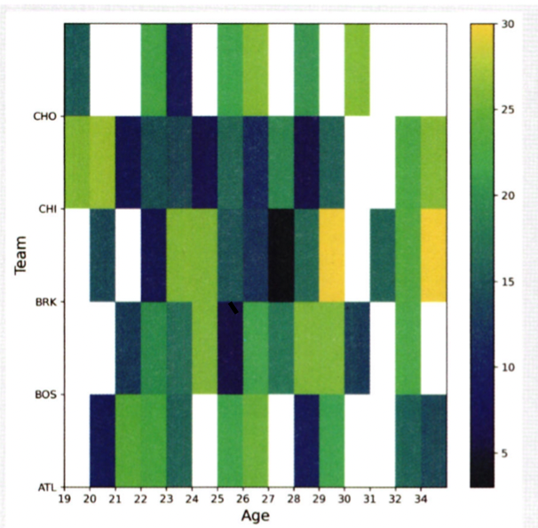

# 통계학 4주차 정규과제

📌통계학 정규과제는 매주 정해진 분량의 『*데이터 분석가가 반드시 알아야 할 모든 것*』 을 읽고 학습하는 것입니다. 이번 주는 아래의 **Statistics_4th_TIL**에 나열된 분량을 읽고 `학습 목표`에 맞게 공부하시면 됩니다.

아래의 문제를 풀어보며 학습 내용을 점검하세요. 문제를 해결하는 과정에서 개념을 스스로 정리하고, 필요한 경우 추가자료와 교재를 다시 참고하여 보완하는 것이 좋습니다.

4주차는 `2부. 데이터 분석 준비하기`를 읽고 새롭게 배운 내용을 정리해주시면 됩니다.


## Statistics_4th_TIL

### 2부. 데이터 분석 준비하기
### 10. 데이터 탐색과 시각화


## Study Schedule

|주차 | 공부 범위     | 완료 여부 |
|----|----------------|----------|
|1주차| 1부 p.2~56     | ✅      |
|2주차| 1부 p.57~79    | ✅      | 
|3주차| 2부 p.82~120   | ✅      | 
|4주차| 2부 p.121~202  | ✅      | 
|5주차| 2부 p.203~254  | 🍽️      | 
|6주차| 3부 p.300~356  | 🍽️      | 
|7주차| 3부 p.357~615  | 🍽️      | 

<!-- 여기까진 그대로 둬 주세요-->

# 10. 데이터 탐색과 시각화

```
✅ 학습 목표 :
* EDA의 목적을 설명할 수 있다.
* 주어진 데이터셋에서 이상치, 누락값, 분포 등을 식별하고 EDA 결과를 바탕으로 데이터셋의 특징을 해석할 수 있다.
* 공분산과 상관계수를 활용하여 두 변수 간의 관계를 해석할 수 있다.
* 적절한 시각화 기법을 선택하여 데이터의 특성을 효과적으로 전달할 수 있다.
```
<!-- 새롭게 배운 내용을 자유롭게 정리해주세요.-->

### 시작에 앞서...
💡 __EDA와 데이터 시각화는 구별해야 함__      
→ 데이터 시각화의 궁극적 목적은 `분석 결과를 커뮤니케이션` 하기 위함!

## 10.1 탐색적 데이터 분석
✏️ __존 튜키의 EDA__   
: 가공하지 않은 원천의 데이터를 있는 기술통계와 데이터 시각화를 통해 그대로 탐색하고 분석하는 기법  
❗️ 단, 극단적인 해석은 피하고 지나친 추론이나 자의적 해석 또한 지양한다

🔠 __EDA의 주요 목적__

- 데이터의 형태와 척도가 분석에 알맞게 되어있는지 확인
- 데이터의 평균, 분산, 분포, 패턴 등의 확인을 통해 데이터 특성 파악
- 데이터의 결픅값이나 이상치 파악 및 보완
- 변수 간의 관계성 파악
- 분석 목적과 방향성 점검 및 보정

✏️ __엑셀을 활용한 EDA__    

- 엑셀을 통해 변수와 설명리스트와 함께 눈으로 쭉 살펴보기   
✔️ 데이터에 대한 전반적인 파악 가능
- 피벗 테이블을 생성해서 집단별 통계값을 확인하거나 간단한 그래프 생성하기   
✔️ 간단하게 데이터에 대한 심리적 거리감을 줄여주는 보조적인 방법

🔢 __파이썬을 활용한 기본 EDA__   

1. 패키지 임포트 (전처리 - pandas, 시각화 - seaborn, matplotlib)
2. head() 통해 칼럼 확인
3. info() 통해 각 칼럼 속성 및 결측치 확인
4. describe() 통해 각 칼럼 통계치 확인
5. skew() 통해 각 칼럼 왜도 확인
6. kurtosis() 통해 각 칼럼 첨도 확인
7. 칼럼 분포 시각화 (distplot(), violinplot(), stripllot() 등)

<br>
<br>

## 10.2 공분산과 상관성 분석

- 이전까지 한 분석: 변수들의 특성을 파악

- 공분산과 상관계수: 변수 간의 상관관계 파악
    - 통계적 정확도를 감소시키는 다중공선성 방지   
    - 데이터에 대한 이해도 향상

✏️ __공분산__    
: 서로 공유하는 분산 (두 분산의 관계)
$${\mathrm{Cov}}(X, Y) = \frac{1}{n} \sum_{i=1}^{n} (X_i - \bar{X})(Y_i - \bar{Y})$$
(표본 공분산의 경우 분모에 n 대신 n-1) 

💡 공분산을 통해 두 변수가 양의 상관관계인지, 음의 상관관계인지, 상관관계가 존재하지 않는지 확인할 수 있다

✏️ __상관계수__   
: 공분산을 정규화시킨 값 (상관성 반영)

- 피어슨 상관계수
$$r = \frac{ \mathrm{Cov}(X, Y) }{ \sigma_X \sigma_Y }$$

💡 해석 (숫자는 절댓값)
- 0: 상관관계가 존재하지 않음
- 0.1~0.3: 약한 상관관계 존재
- 0.4~0.6: 어느 정도 상관관계 존재
- 0.7~0.9: 강한 상관관계 존재
- 1: 완벽한 상관관계 존재

❗️ _산점도의 기울기와 상관계수는 관련이 없음_   
→ 상관계수가 높다는 것은 다른 변수를 예상할 수 있는 정확도, 즉 `설명력`이 높다는 것!

❗️상관분석은 `그래프의 모양`이나 `이상치`에 영향을 많이 받기 때문에 다양한 통계적 방법과 시각화 기법을 함께 사용해야 함

🔠 __변수 척도에 따른 상관분석 방법__


🔢 __파이썬을 활용한 공분산과 상관성 분석__
1. 패키지 임포트 (seaborn, matplotlib, pandas, numpy)
2. head() 통해 변수 확인
3. 산정도 행렬 시각화 
    
4. cov() 통해 공분산 확인
5. corr() 통해 상관계수 확인 (기본값은 피어슨 상관계수)
6. 상관계수 히트맵 시각화
7. 정확한 수치와 함께 보기 위해 clustermap 히트맵 시각화
8. 히트맵 중복 부분 제거를 통해 가독성 높이기  
    

<br>
<br>

## 10.3 시간 시각화
✏️ __시간 시각화__   
: 시점 요소가 있는 데이터를 시계열 형태로 표현하는 것 

✔️ 전체적인 흐름 한눈에 확인 가능   
✔️ 데이터의 트렌드나 노이즈 발견 가능   
✔️ 연속형 시간 시각화와 분절형 시간 시각화로 나뉨

🔠 __연속형 시간 시각화__

: __선그래프__ 는 시간 간격의 밀도가 높을 때 사용   
→ 데이터의 양이 너무 많거나 변동이 심하면 패턴 파악을 위해 `추세선` 삽입

🔠 __분절형 시간 시각화__

- 막대그래프
- 누적 막대그래프: 한 시점에 2개 이상의 세부 항목 존재할 때
- 점 그래프

🔢 __파이썬을 활용한 시간 시각화__

1. 패키지 임포트 (matplotlib, pandas, datetime)
2. head() 통해 데이터 확인
3. 선그래프 시각화를 위한 데이터 가공 (날짜 형식 변환, 날짜 오름차순 정렬 등)
4. 선그래프 시각화 (이동평균선 추가)
5. 막대그래프 시각화 (groupby() 이후)
6. 누적막대그래프 시각화 (groupby(), 피벗 이후)

<br>
<br>

## 10.4 비교 시각화

✏️ __히트맵 차트__   
: 그룹과 비교 요소가 많을 때 효과적으로 시각화할 수 있는 방법   

✔️ 현재 가지고 있는 데이터의 구조와 확인하고자 하는 목적을 정확히 파악한 다음 차트를 그려야 함   
✔️ 분류 그룹이나 변수의 수를 적정 수준으로 정제해야 함

✏️ __방사형 차트__   


✏️ __평행 좌표 그래프__ 


✔️ 변수별 값을 정규화하면 차이를 더욱 부각시킬 수 있음   
✔️ 각 그룹의 요소별 차이 수준을 효과적으로 파악할 수 있음   
✔️ 집단적 경향성을 표현하는데 용이

🔢 __파이썬을 활용한 비교 시각화__
1. 패키지 임포트 (+math, pandas.plotting)
2. head() 통해 데이터 확인
3. 데이터 전처리
4. V1 시각화 위한 전처리 (필터링, 칼럼 선택)
5. 히트맵 시각화  


6. V2 시각화 위한 전처리 (평균 계산, 피벗)
7. 히트맵 시각화 V2  
    

8. 방사형 차트 시각화 위한 인덱스 초기화 (df.reset.index())

9. 방사형 차트 시각화 (하나의 차트에 하나의 그룹)  
    

10. 방사형 차트 시각화 (하나의 차트에 모든 그룹)  
    

11. 평행 좌표 그래프 시각화  
    


<br>
<br>

## 10.5 분포 시각화

✏️ __히스토그램__    
: 겹치지 않는 변수의 구간을 동일하게 나눠서 구간별 도수를 막대그래프로 표현   

✔️ 양적 척도를 나타냄    
✔️ 각 구간을 bin이라고 함   
✔️ 구간의 높이는 밀도(density), 즉 가로축의 단위 구간에 속한 값의 `비율`을 나타냄    
✔️ 처음에 20개 정도 구간으로 세세하게 나누어 분포를 살펴본 후, 정보의 손실이 커지기 전까지 조금씩 구간의 개수를 줄여서 나타낸다


✏️ __파이차트, 도넛차트__   
: 전체를 100%로 하여 구성 요소들의 분포 정도를 면적(각도)으로 표현


✏️ __트리맵 차트__   
: 하나의 큰 사각형을 구성 요소의 비율에 따라 작은 사각형으로 쪼개어 분포 표현

✔️ 구성 요소가 복잡한 질적 척도를 표현하는데 적합    
❗️ 구성 요소들 간의 규모 차이가 크면 표현이 어려울 수 있음

✏️ __와플 차트__   
: 와플처럼 일정한 네모난 조각들로 분포를 표현


❗️ 트리맵 차트처럼 위계구조를 표현하지는 못함

🔢 __파이썬을 활용한 분포 시각화__   
1. 패키지 임포트 (plotly와 pywaffle 설치)
2. head() 통해 데이터 확인

3. 히스토그램 시각화  


4. 변수 구분하여 히스토그램 시각화  


5. 파이차트 시각화  


6. 도넛차트 시각화  


7. 트리맵 차트 시각화  


8. 와플차트 시각화  


<br>
<br>

## 10.6 관계 시각화

✏️ __산점도__   
: 하나의 요소는 $X$축, 다른 한 요소는 $Y$축에 대입하여 일치하는 지점에 점을 찍어 표현한 그래프   

✔️ 점들의 분포와 추세를 통해 두 변수 간의 관계 파악 가능    
✔️ 점들이 서로 겹쳐서 정보를 제대로 확인하기 어려울 때 각각의 점에 투명도를 주어 밀도를 함께 표현할 수 있음   
💡 극단치로 인해 주요 분포 구간이 압축되어 시각화의 효율이 떨어지는 것을 방지하기 위해 극단치를 제거하고 그리는 것이 좋음


❗️ 두 개의 변수 간 관계만 표현할 수 있다는 단점이 있음

✏️ __버블 차트__   
: 버블의 크기를 통해 한 가지 요소를 추가적으로 봄으로써 세 가지 요소의 상관관계를 표현할 수 있는 차트 (농도 추가하면 네 가지 요소) 
  
❗️ 원의 지름이 아닌 면적을 통해 크기를 판단하도록 주의해야 함 (지름이 두 배 크면 실제 크기는 네 배)   

🔢 __파이썬을 활용한 관계 시각화__   

1. 패키지 임포트 
2. head() 통해 데이터 확인
3. 기본 산점도 시각화  


4. 산점도 회귀선 시각화  


5. 버블 차트 시각화  


<br>
<br>

## 10.7 공간 시각화
💡 공간 시각화는 일반적인 시각화 방법처럼 단순 이미지로 표현되는 것이 아닌, 지도를 확대하거나 위치를 옮기는 등 인터랙티브 한 활용 가능!    
→ 정보를 효과적으로 전달할 수 있도록 `스토리라인`을 잡고 시각화를 적용하는 것이 좋음

✏️ __도트 맵__   
: 지리적 위치에 동일한 크기의 작은 점을 찍어서 해당 지역의 데이터 분포나 패턴 표현

✔️ 데이터의 개요를 파악하는데 유리함
❗️ 정확한 값을 전달하는 데에는 적합하지 않음


✏️ __버블 맵__   
: 버블차트를 지도에 그대로 옮겨둔 것  
 
✔️ 데이터 값이 원의 크기로 표현되기 때문에 코로플레스맵보다 비율 비교 효과적   
❗️ 지나치게 큰 버블이 다른 지역의 버블과 영역이 겹칠 수 있음

✏️ __코로플레스맵(단계 구분도)__   
: 데이터 값의 크기에 따라 색상의 음영을 달리하여 해당 지역에 대한 값 시각화 
    
✔️ 여러 색상 혼합, 투명도, 명도, 채도 통해 다양하게 표현    
❗️ 정확한 수치를 인지하고 비교하는 것이 어려움    
❗️ 작은 지역들에 비해 큰 지역이 강조되는 인상을 줄 수 있음

✏️ __커넥션맵(링크맵)__   
: 지도에 찍힌 점들을 곡선 또는 직선으로 연결하여 지리적 관계 표현 (경로 표현 가능)  

✔️ 연결선의 분포나 집중도를 통해 지리적 관계의 패턴을 파악하기 위해 사용    
✔️ 지역 간의 무역 관계나 항공 경로나 통신 정보 흐름 등을 표현할 때 사용    
🔸 플로우 맵: 커넥션맵과 유사하게 선을 표현하지만 시작점과 도착점이 함께 표현됨   
🔸 카토그램: 각 지역의 면적을 데이터 값에 비례하도록 변형시켜 시각화


🔢 __파이썬을 활용한 공간 시각화__  

1. 패키지 임포트 (folium, plotly)
2. head() 통해 데이터 확인
3. 기본 지도 시각화 (zoom_start 옵션 통해 확대 수준 지정 가능)  


4. 지도 형태 변경  
- tiles 옵션 통해 Stamen Toner, Stamen Watercolor, Stamen Terrain, Cartodb Positron, Cartodb Dark_matter 등의 옵션으로 변경 가능  
- CircleMarker(), Marker() 함수 통해 원 표시와 포인트 그림 삽입 가능

5. 군집 마커 시각화 (MarkerCluster() 함수 사용)  


6. 도트맵 시각화  


7. 버블맵 시각화를 위한 데이터 가공 (latitude, longitude 평균값 구하여 각 구의 중심 지점 만들기)

8. 버블맵 시각화 (json 파일 불러와서 구별 경계선 추가)  


9. 코로플레스맵 시각화 (choropleth() 함수 사용하여 json 데이터와 실업률 데이터 적용)  


10. 커넥션맵 시각화 (graph_objects 패키지 활용하여 직접 위경도 입력)  


<br>
<br>

## 10.8 박스 플롯

✏️ __박스 플롯(상자 수염 그림)__   
: 네모 상자 모양에 최댓값과 최솟값을 나타내는 선이 결합된 모양의 데이터 시각화 방법   


✔️ 하나의 그림으로 양적 척도 데이터의 분포 및 편향성, 평균과 중앙값 등 다양한 수치를 보기 쉽게 정리해줌    
✔️ 특히 두 변수의 값을 비교할 때 효과적    
✔️ 데이터의 대체적인 분포 형태를 쉽게 확인하기 위해 사용   
✔️ 카테고리별 분포를 비교할 때도 유용하게 사용   

🔢 __박스 플롯의 다섯 가지 수치__    
1. 최솟값: 제1사분위 - 1.5IQR
2. 제1사분위(Q1): 25% 위치
3. 제2사분위(Q2): 50% 위치(중앙값)
4. 제3사분위(Q3): 75% 위치
5. 최댓값: 제3사분위 - 1.5IQR   

💡 __박스 플롯의 해석__


✔️ 최댓값을 넘어선 이상치 존재 → 오른 꼬리가 긴 분포
✔️ 중앙값이 다소 아래에 있음 → 오른쪽으로 약간 치우친 분포   
✔️ 최솟값 범위보다 실제 최솟값이 훨씬 높이 위치해 있음 → 왼쪽으로는 데이터가 적게 퍼져있음

❗️ 박스 플롯은 데이터의 분포를 정형화시켜 정보를 축약한 것   
→ 박스 플롯을 해석할 때는 항상 `데이터 분포도`를 함께 떠올리자!


🔢 __파이썬을 활용한 박스 플롯 시각화__    
1. 패키지 임포트
2. head() 통해 데이터 확인
3. 기본 박스 플롯 시각화 (가로, 세로)  


4. 그룹별 박스 플롯 시각화  


5. 박스플롯 추가 옵션 적용 (평균, 데이터 포인트 포함)  


    


<br>
<br>

# 확인 문제

## 문제 1.
> **🧚 공분산과 상관계수의 차이점에 대해 간단히 설명하세요.**

```
상관계수는 공분산을 정규화시킨 값으로 상대성을 반영한다. 상관계수는 공분산과 달리 -1~1 사이의 값을 가진다.
```

## 문제 2.
> **🧚 다음 데이터 분석 목표에 적합한 시각화 방법을 보기에서 모두 골라 연결해주세요.**

> 보기: 산점도, 선그래프, 막대그래프, 히스토그램, 박스플롯

(a) 변수의 분포 확인   
(b) 두 변수 간의 관계 확인   
(c) 집단별 평균 비교   
(d) 시계열 데이터 분석

<!--중복 가능-->

```
(a): 히스토그램, 박스플롯
(b): 산점도
(c): 막대그래프
(d): 선그래프, 막대그래프
```


### 🎉 수고하셨습니다.