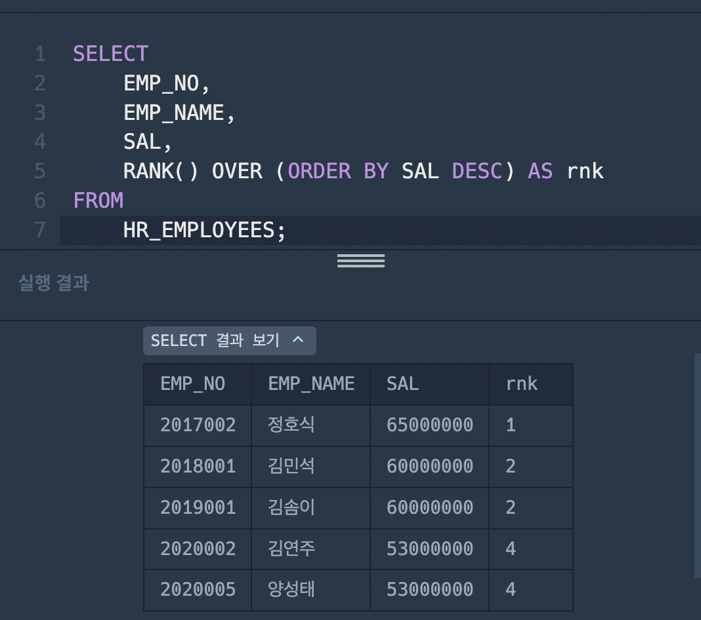

### 1번문제

```sql
SELECT *
FROM (SELECT FOOD_TYPE, REST_ID, REST_NAME, MAX(FAVORITES) AS FAVORITES
FROM REST_INFO
GROUP BY FOOD_TYPE
ORDER BY FOOD_TYPE DESC
```
틀린 이유: 서브 쿼리에서 GROUP BY 문이 실행되면 MAX(FAVORITES)값이 다르게 나타날 수 있음   
따라서 GROUP BY의 범위를 수정해야 함

### 2번 문제
```sql
WITH RankedRest AS (   
    SELECT 
        FOOD_TYPE, REST_ID, REST_NAME, FAVORITES,
        ROW_NUMBER() OVER (PARTITION BY FOOD_TYPE ORDER BY FAVORITES DESC, REST_ID) AS rnk
    FROM REST_INFO
)

```
- WITH 절 이용한 RankedRest라는 CTE 정의
- CTE: 일시적인 테이블을 만들어 쿼리에서 재사용할 수 있게 함
- PARTITION BY: 칼럼별로 그룹화
- ROW_NUMBER(): 각 그룹 내에서 번호 부여

```sql
SELECT 
    FOOD_TYPE, REST_ID, REST_NAME, FAVORITES
FROM RankedRest
WHERE rnk = 1
ORDER BY FOOD_TYPE DESC;
```
- FROM RankedRest: CTE 불러오기
- WHERE rnk = 1: rnk 값이 1인 행 선택

장점: ROW_NUMBER을 이용하여 가독성이 좋다 -> 그룹 내에서 1위인 값을 출력하는구나!

### 3번 문제

1. RANK()


1 2 2 4 4 로 나타남

2. DENSE_RANK()


1 2 2 3 3 으로 나타남

3. ROW_NUNMBER()


1 2 3 4 5 로 나타남

- RANK: 동일 순위는 같은 값 가짐, 순위값은 앞 순위까지의 누적개수 +1이 됨
- DENSE_RANK: 동일 순위는 같은 값 가짐, 순위값은 단순히 앞 순위 +1임
- ROW_NUMBER: 각 행의 고유한 순위값을 가짐
